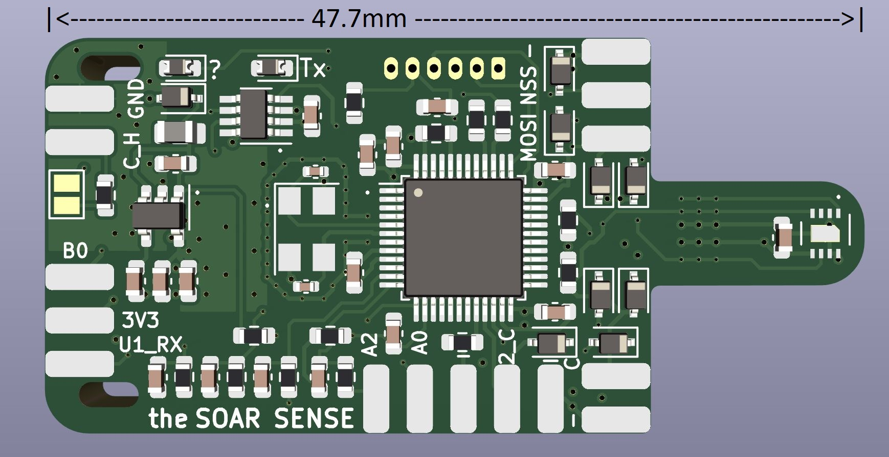
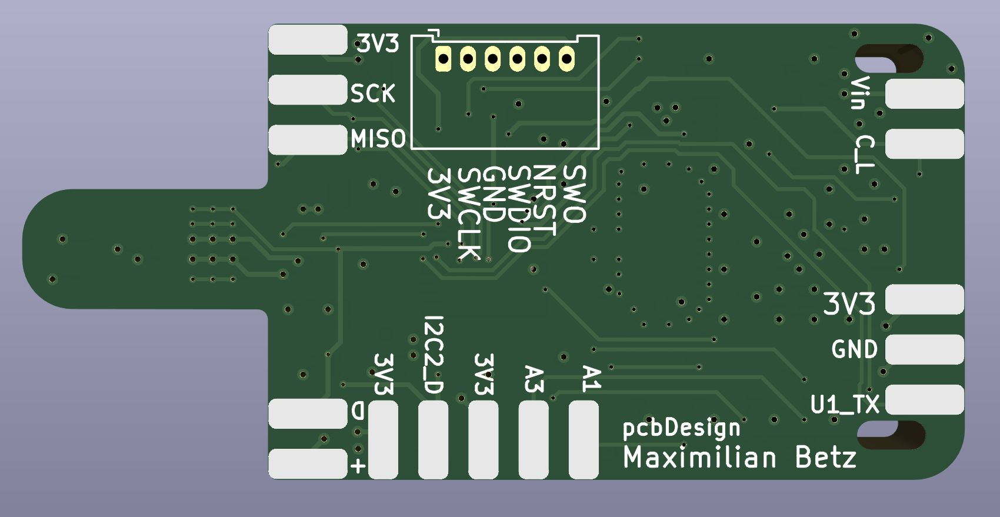

# PCB design for sense module
Minimalistic very small temperature and humidity sensing device with CAN interface. Could also be used for other CAN bus attached sensing tasks. 

## Facts
- SWD interface
- STM32F103 48LQFP 8 MHz Crystal 
- CAN transceiver: MAX3051EKA+T 
- 5 to 16V power supply with 3.3V LDO: SPX3819M5-L-3-3/TR
- Temperature and Humidity sensing with SHT35-DIS-B or SHT31
- 4 analog inputs, SPI, 2 I2C and UART 
- Boot0 pin available for flashing via UART
- Pcb size 47.7mm x 23.2mm

## 3D Preview 

## TODO
- backside solder pads for differential pressure package 
- more backside connectors 
- review and feedback
- are the cable solder connections the right choice?
- make sensor voltage switchable! 
- add some signal leds